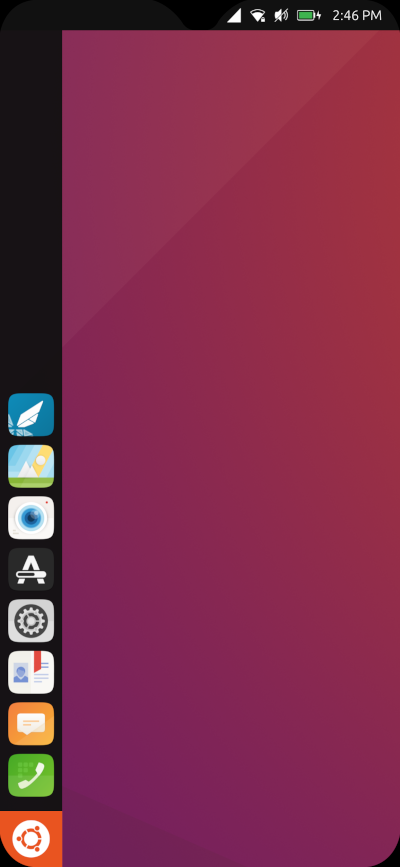
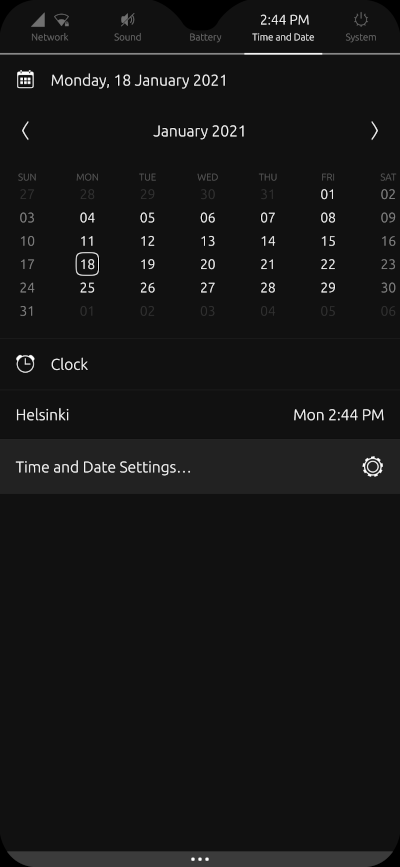
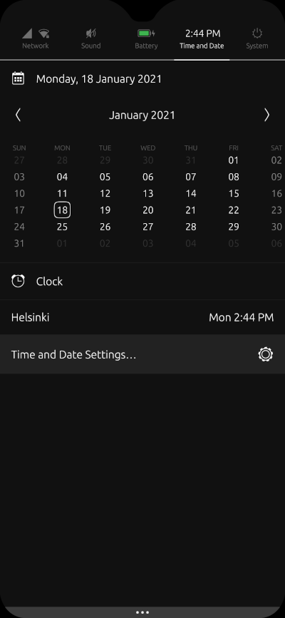
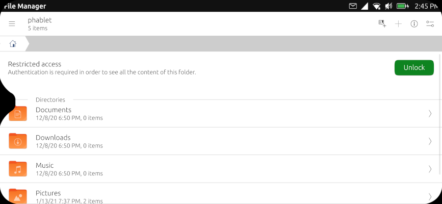
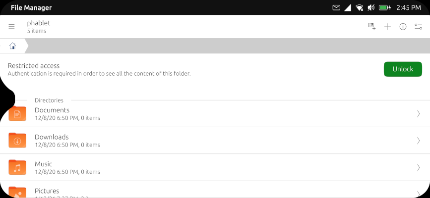

# lomiri-notch-hax
Lomiri (formely Unity 8) patches for improved display notch and rounded corners support on devices such as the Volla Phone.

## Supported devices
* Volla Phone
* Volla Phone X
* OnePlus 6/6T
* Xiaomi Mi Mix 3 (only extra margin for top-right side)
* Xiaomi Poco F1
* Xiaomi Redmi Note 7
* Xiaomi Redmi Note 9S

## Applying the patch
Simply run the script in this repo as the `phablet` user:
```bash
wget -O apply-notch-hax.sh https://git.io/JtIpG
chmod +x apply-notch-hax.sh
./apply-notch-hax.sh
```

## Reversing the patch
You can just run the same `apply-notch-hax.sh` script again while answering `y` to each of the `Assume -R?` questions :)

## Screenshots

### Panel bar height & right side margin
|  |  |
|:--:|:--:|
| *Before patch* | *After patch* |

### Panel menu top margin
|  |  |
|:--:|:--:|
| *Before patch* | *After patch* |

### Window title left margin
|  |
|:--:|
| *Before patch* |
|  |
| *After patch* |
