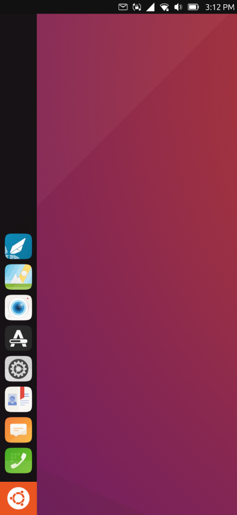
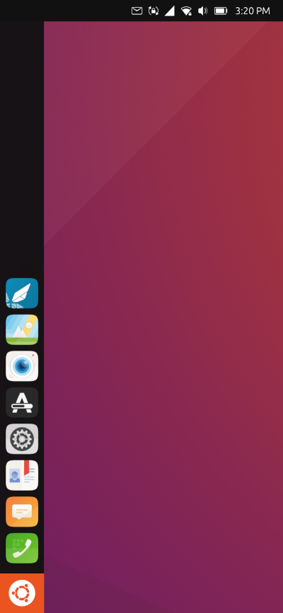

# vollanotchfix
Temporary menu bar solution for notch and rounded corners of the Volla Phone.

## Applying the patch
Simply run the script in this repo as the `phablet` user:
```bash
wget -O apply-vollanotchfix.sh https://git.io/JtUiu
chmod +x apply-vollanotchfix.sh
./apply-vollanotchfix.sh
```

## Reversing the patch
You can just run the same `apply-vollanotchfix.sh` script again while answering `y` to each of the `Assume -R?` questions :)

## Screenshots
|  |  |
|:--:|:--:|
| *Before patch* | *After patch* |
